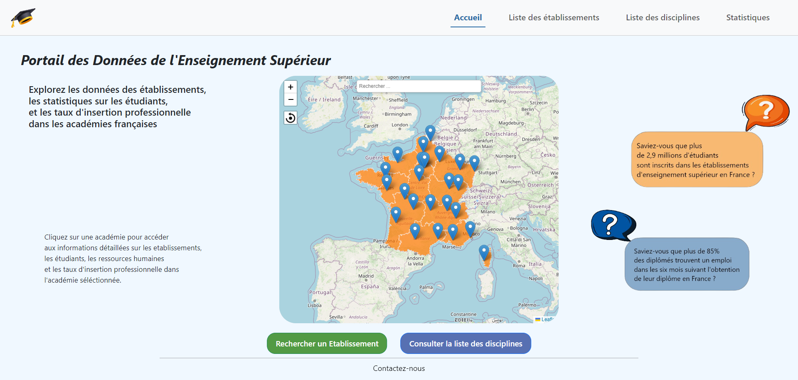
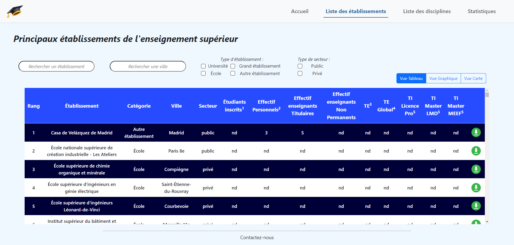
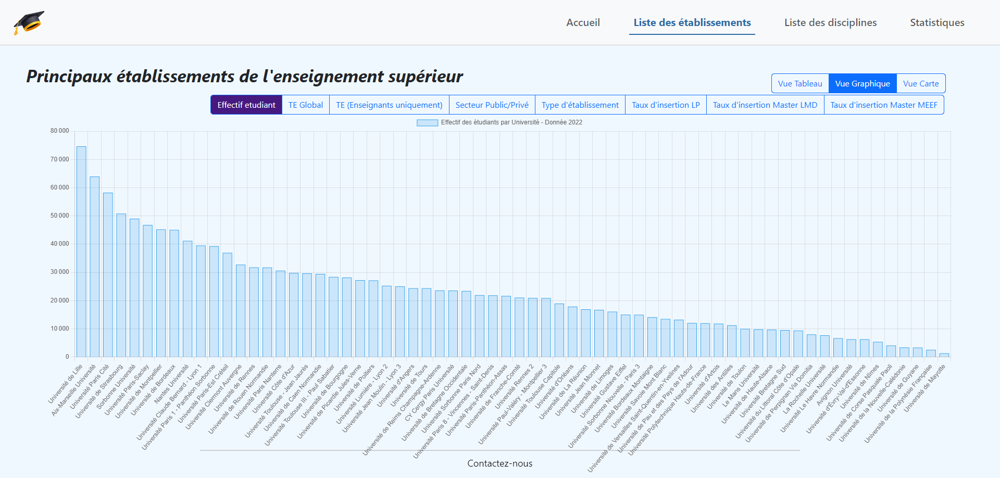
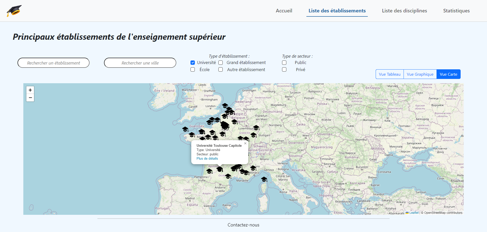
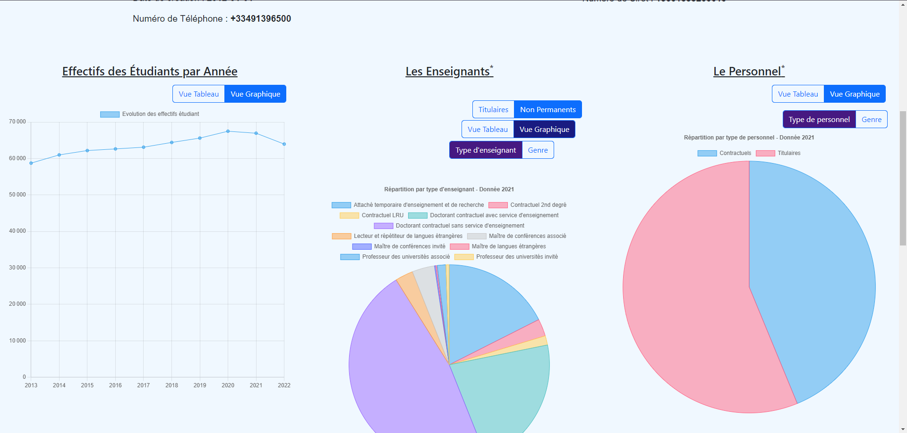
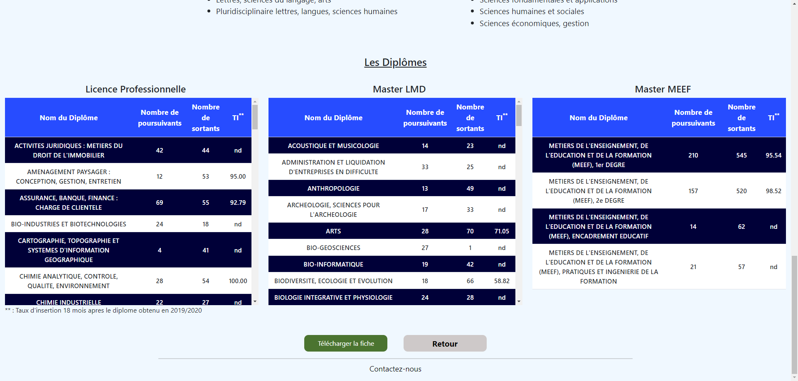
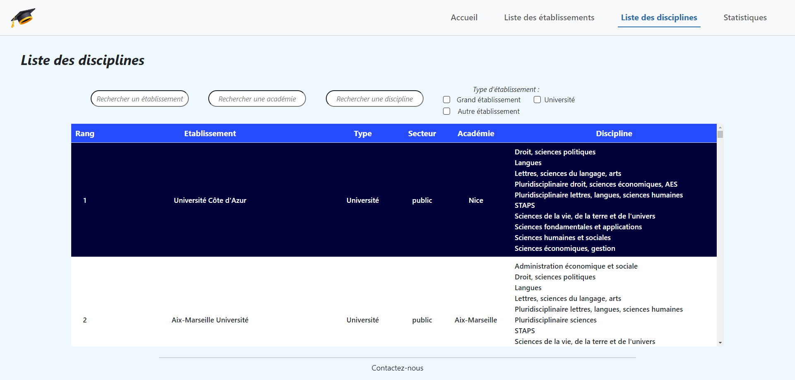
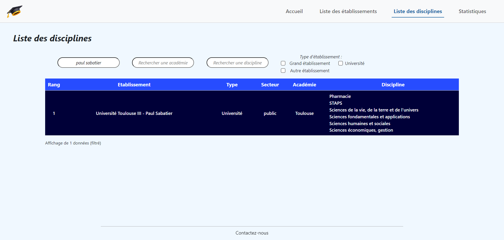
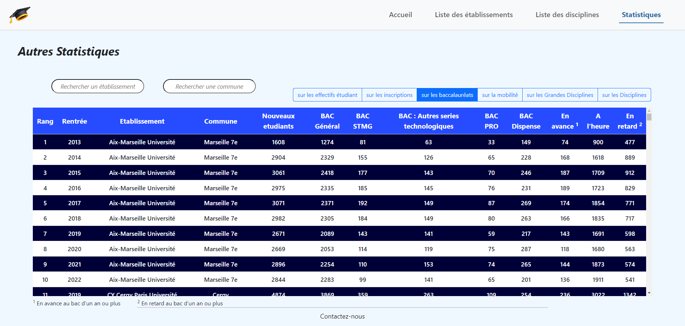

<h1 align="center">Présentation</h1>
Réalisation d'une application web qui permettra de consulter les données sur les établissements, etudiants et personnels sous forme de tableaux, et de différents graphes. 
Les données doivent etre récupéré, au préalable, à partir de l'API "OPENDATA" du ministere de l'enseignement supérieur et de la recherche avant d'etre insérer dans une base de donnée

<h2>Exemple d'interface :</h2>

* <h3>Page d'Accueil</h3>
Nous pouvons d'ores et deja séléctionner une académie française afin d'afficher les établissements qui s'y trouve 

  

* <h3>Page de la liste des établissements</h3>

  

* <h3>Les graphes comparant les différents établissements</h3>

  

* <h3>Carte de la liste des établissements</h3>

  

* <h3>Le détail d'un établissement séléctionné</h3>

  
  

* <h3>Page de la liste des disciplines</h3>

  

* <h3>Recherche d'une université dans la liste des disciplines</h3>

  

* <h3>Autres statistiques</h3>

  

